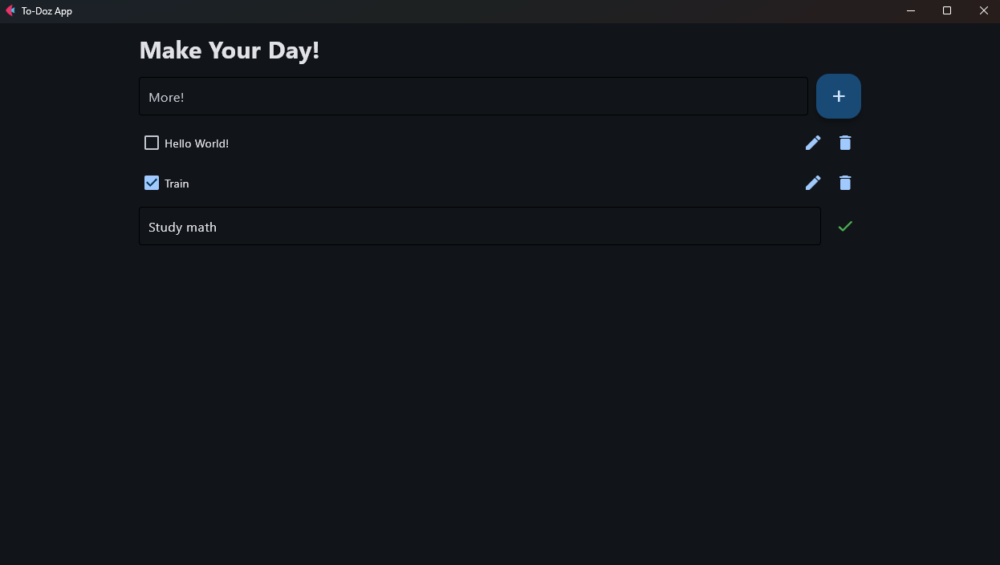

# To-Doz

A simple and intuitive To-Do application built using **Flet**, a Python framework for creating interactive multi-user web, desktop, and mobile apps.



---

## Features

- **Add Tasks**: Easily add new tasks to your to-do list.
- **Mark as Complete**: Check off tasks when they're done.
- **Edit Tasks**: Change task's name as you want.
- **Delete Tasks**: Remove tasks you no longer need.
- **Responsive Design**: Works seamlessly on desktop and mobile devices.

---

## Prerequisites

Before running the app, ensure you have the following installed:

- Python 3.7 or higher
- Flet library

---

## Installation

**Clone the repository**:
   ```bash
   git clone https://github.com/lucaslimabica/To-Doz.git
   cd To-Doz
   python src/main.py
  ```

---

## Scructure
  ```bash
  to-doz/
  ├── src/
      └── main.py        # Main application logic
  ├── README.md          # Project documentation
  └── requirements.txt   # List of dependencies
  ```

---

## Contributing

**Contributions are welcome!** If you'd like to contribute, please follow these steps:

- Fork the repository.
- Create a new branch (git checkout -b feature/your-feature).
- Commit your changes (git commit -m "Add your feature").
- Push to the branch (git push origin feature/your-feature).
- Open a pull request.

